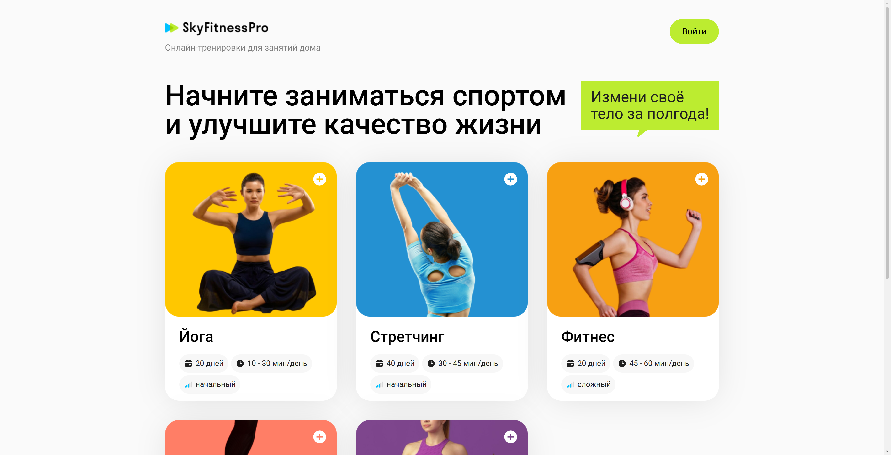
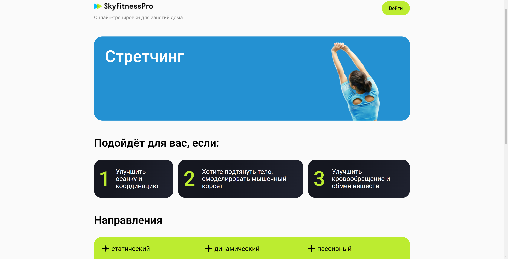
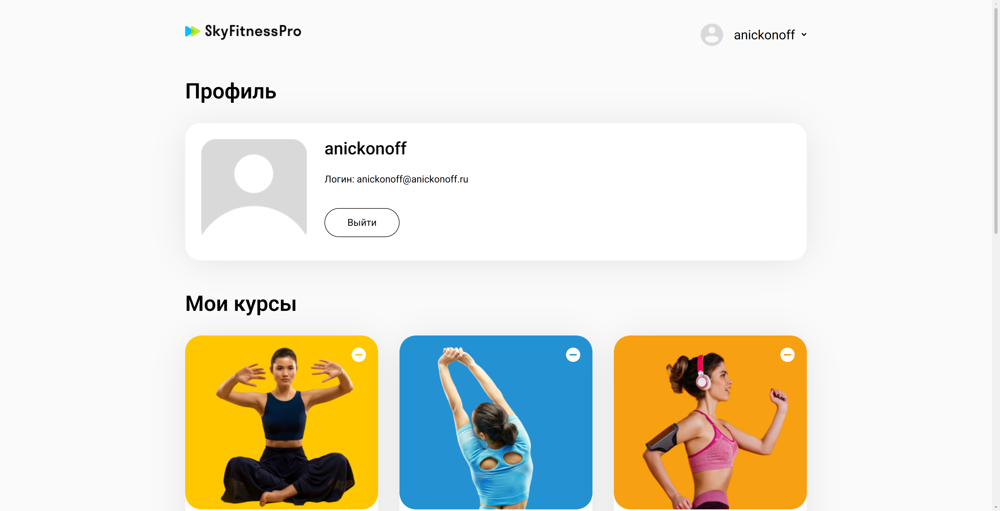

# SkyFitnessPro

SkyFitnessPro — веб-приложение для прохождения онлайн-курсов по фитнесу, разработанное в качестве дипломного проекта курса Frontend-разработки. Пользователь может зарегистрироваться, выбрать курс, выполнять тренировки, отслеживать прогресс и управлять своими курсами через личный кабинет.

- 🌐 **Демо:** https://project9.anickonoff.ru
- ⚛️ **Стек:** Next.js 16 · React 19 · TypeScript · Tailwind CSS
- 🧪 **Тестирование:** Jest


## Скриншоты

| Каталог | Тренировка |
|----------|------------|
|  |  |

| Курс | Профиль |
|------|----------|
|  |  |

---

## Возможности

- Регистрация и авторизация пользователей
- Просмотр каталога фитнес-курсов
- Просмотр подробной информации о курсах
- Добавление и удаление курсов из личного кабинета
- Просмотр списка тренировок выбранного курса
- Выполнение упражнений с сохранением прогресса
- Автоматическое определение завершения тренировки
- Отображение прогресса прохождения каждого курса
- Личный кабинет пользователя
- Адаптивный интерфейс для ПК, планшетов и мобильных устройств
- Обработка ошибок при работе с API

---

## Особенности реализации

- приложение построено на Next.js App Router;
- маршруты разделены на публичную и приватную части;
- управление состоянием пользователя реализовано через React Context API;
- все HTTP-запросы выполняются через единый экземпляр Axios с интерцепторами;
- JWT-токен хранится в `localStorage`;
- порядок тренировок синхронизируется с порядком, заданным курсом;
- прогресс пользователя автоматически рассчитывается и синхронизируется с сервером;
- основные утилиты покрыты модульными тестами на Jest.

---

## Стек технологий

| Технология | Версия |
|------------|---------|
| Next.js | 16.2.7 |
| React | 19.2.4 |
| TypeScript | 5 |
| Tailwind CSS | 4 |
| Axios | — |
| Jest | — |
| ESLint | 9 |
| Prettier | — |

---

## Установка

```bash
git clone https://github.com/<your_username>/SkyFitnessPro.git

cd SkyFitnessPro

npm install
```

---

## Запуск

### Режим разработки

```bash
npm run dev
```

### Production-сборка

```bash
npm run build
npm run start
```

### Проверка кода

```bash
npm run lint
```

### Запуск тестов

```bash
npm test
```

---

## Структура проекта

```
src
├── app
│   ├── (public)
│   └── (private)
├── components
├── context
├── services
├── hooks
├── utils
├── constants
└── types
```

---

## Архитектура

Проект построен на **Next.js App Router**.

Особенности реализации:

- разделение публичной и приватной части приложения;
- авторизация реализована через Context API;
- JWT-токен хранится в localStorage;
- единый экземпляр Axios с интерцепторами для работы с API;
- пользовательский прогресс синхронизируется с сервером;
- тренировки отображаются в порядке, определённом курсом;
- модальные окна используются для авторизации, выбора тренировок и ввода прогресса.

---

## API

Приложение использует REST API SkyPro.

Основные возможности API:

- регистрация пользователя;
- авторизация;
- получение списка курсов;
- получение списка тренировок;
- получение данных пользователя;
- сохранение прогресса тренировок.

Адрес API задаётся в файле:

```
src/constants/constants.ts
```

---

## Тестирование

Для модульного тестирования используется **Jest**.

Покрыты тестами основные функции обработки данных приложения, включая вычисление прогресса пользователя и работу со вспомогательными утилитами.

---

## Используемые инструменты

- Next.js App Router
- React Context API
- Axios
- Tailwind CSS
- Jest
- ESLint
- Prettier

---

## Автор

Антон Никонов